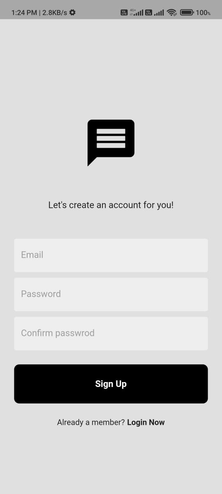
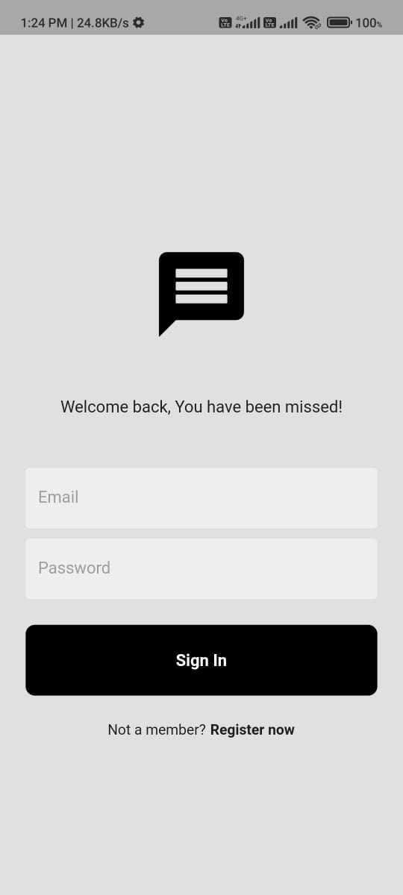
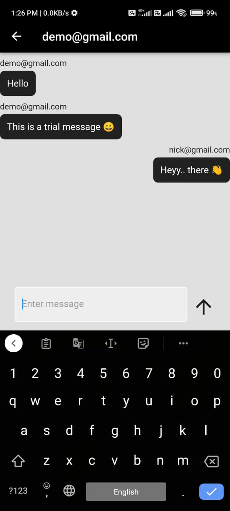

---
# Chat App usign Flutter and Firebase

A Flutter-based chat application that allows users to register, log in, and exchange messages in real-time using Firebase Authentication and Cloud Firestore.

## Features

- User Registration: Users can create new accounts with email and password.
- User Login: Registered users can log in using their credentials.
- Real-time Chat: Users can send and receive messages in real-time.
- User Authentication: Firebase Authentication is used for secure user authentication.
- Message Storage: Messages are stored in Firebase Cloud Firestore.
- Clean and Intuitive UI: A user-friendly interface for an enjoyable chat experience.

## Technologies Used

- Flutter: A UI toolkit for building natively compiled applications for mobile, web, and desktop.
- Firebase: A comprehensive app development platform provided by Google.

## Installation

1. Clone the repository:

   ```bash
   git clone https://github.com/your-username/your-chat-app.git
   ```

2. Navigate to the project directory:

   ```bash
   cd your-chat-app
   ```

3. Install dependencies:

   ```bash
   flutter pub get
   ```

4. Configure Firebase:
   
   - Create a Firebase project on the [Firebase Console](https://console.firebase.google.com/).
   - Set up Firebase Authentication and Firestore in your project.
   - Add your Firebase configuration files to the project. These files typically include `google-services.json` (for Android) and `GoogleService-Info.plist` (for iOS).
   
5. Run the app:

   ```bash
   flutter run
   ```

## Usage

1. Register a new account or log in using your credentials.
2. Start chatting with other users by selecting a contact or entering their email address.
3. Send and receive real-time messages.

## Screenshots







---
